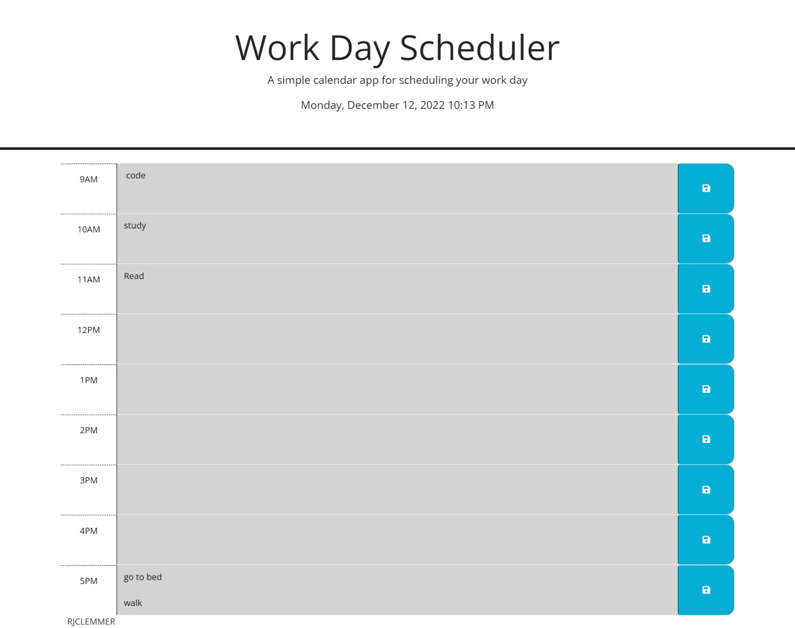

# 05 Third-Party APIs: Work Day Scheduler

## Your Task

I created a simple calendar application that allows a user to save events for each hour of the day by modifying starter code. This app will run in the browser and feature dynamically updated HTML and CSS powered by jQuery and uses Day.js.

## Live Link

https://rjclemmer.github.io/challenge5/

## Screenshot



## User Story


AS AN employee with a busy schedule
I WANT to add important events to a daily planner
SO THAT I can manage my time effectively
```

